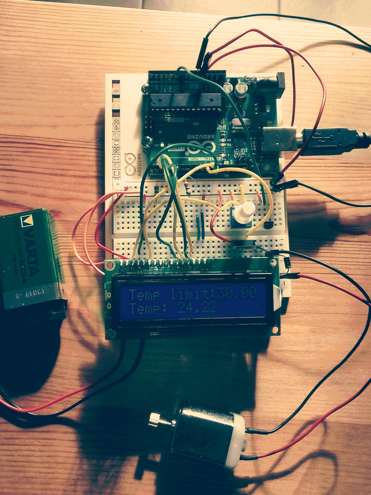

AirCooler
---
This prototype aims is to provide a cheap own made portable air cooler system.

The idea is to automatically start a ventilator on a hermetic bowl when the temperature is above a limit.

The bowl is full of ice and has a hole with a tube: the air from ventilator should produces a fresh air for your room.

## Hardware required
* Arduino Uno
* Temperature Sensor (DS18B20)
* DC Motor
* LCD-Display 16x2 HD44780
* one MOSFET
* one Potentiometer
* one diode
* two resistors 220 ohm
* 9V battery

## Eletronic circuit

## How use it

Clone this repo in your Arduino folder, validate it and upload on your Arduino after having create the circuit.